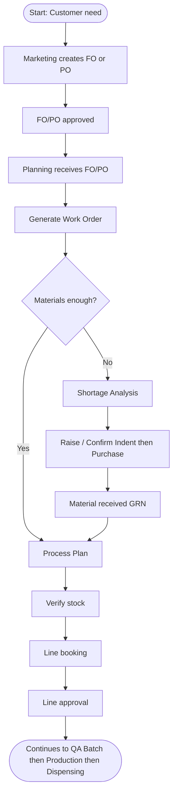
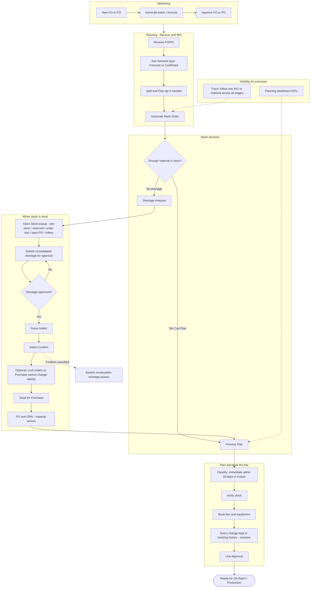
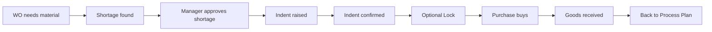
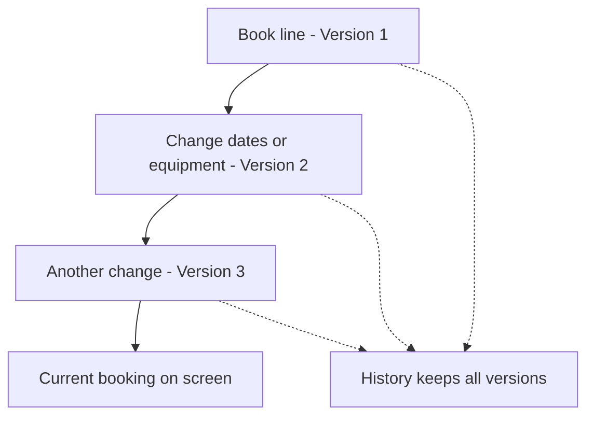
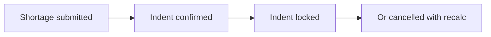
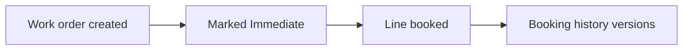

# Medicap MRP — Complete Flow Guide (User Manual)

**Who this is for:** Planning, Marketing, Purchase, Stores, and managers who need to understand how Material Requirement Planning (MRP) works in Medicap — without technical detail.

**Plant:** Medicap Laboratories (1126)  
**What this covers:** The live Planning / STP path as it works today, including the improvements added in 2026 (Forecast vs Confirmed, stock popup, shortage approval, indent lock, Immediate/Future plan class, line-booking history, cancel recalculation, and traceability/KPIs).

---

## 1. Big picture (one page)

Think of MRP as answering three questions, in order:

1. **What do we need to make?** (customer FO/PO → work order)
2. **Do we have the materials?** (stock check → buy if short)
3. **When and on which line do we make it?** (process plan → verify → book line → approve)

---

## 2. Everyday stages (where you work in the software)

| Step | What the user does | Screen (menu path) |
|------|--------------------|--------------------|
| A | Enter and approve customer FO/PO | Marketing → PO/FO |
| B | Receive the approved FO/PO into Planning | Planning → **Receive FO/PO** |
| C | Create the work order | Planning → **Generate Work Order** |
| D | If materials are short: analyse and raise indent | Planning → **Shortage Analysis** |
| E | Confirm indent and send to Purchase (when needed) | Planning → **Indent Confirm / Can Plan** |
| F | Decide which WOs can be planned | Planning → STP → **Process Plan** |
| G | Verify stock before booking | Planning → STP → **Verify & Book Stock** |
| H | Book the manufacturing / packing line | Planning → STP → **Line Booking** |
| I | Approve the line booking | Planning → STP → **Line Approval** |

After line approval, the normal Medicap path continues: QA batch approval → Production → Dispensing → IPQA (same as before).

---

## 3. Full operational flowchart (detailed)

---

## 4. What happens when stock is short (simple story)

**Rules users should remember:**

- You **cannot raise an indent** until the consolidated shortage is **Approved** (four-eye control: the person who submitted cannot approve their own request).
- A **Locked indent** is a controlled purchase requirement. To change it, unlock (with a reason) or cancel via the revision path.
- If an indent is **cancelled**, the system takes a recalculation snapshot so Planning can see the updated shortage / open-indent picture.

---

## 5. Immediate vs Future planning (plain English)

| Class | Meaning | Typical next step |
|-------|---------|-------------------|
| **Immediate** | Needed within about **30 days** (or overdue) | Priority for Process Plan → Verify → Line book |
| **Future** | Needed later than 30 days | Keep visible; plan when the window approaches |
| **Not Decided** | No clear delivery / start date yet | Set a date or choose Immediate / Future manually on Process Plan |

This class appears on **Process Plan** and in Planning dashboard KPIs.

---

## 6. Line booking — why history matters

When Planning books (or changes) a line:

- The **current** booking is what the floor uses.
- Every create / update / cancel also saves a **version** in history (who, when, what changed).
- Older versions are **not overwritten** — useful for audits and disputes (“what was booked last week?”).

---

## 7. Traceability and dashboard (see the whole journey)

On the **Planning / STP dashboard** you can:

1. Read **KPI chips** at a glance — Immediate WOs, Locked indents, Pending shortage approvals, Booking history versions, Cancel recalculations.
2. Enter a **Work Order** (e.g. BO002) and/or **Material** (e.g. RM0129) and click **Trace** to see every stage that entry has passed.

Example journey for one material with shortage:

Example journey for one work order ready to make:

---

## 8. Stock popup — what the numbers mean

On Shortage Analysis (and related screens), **Stock** opens a shared material picture:

| Bucket | Meaning for users |
|--------|-------------------|
| Store available | Physically usable stock |
| Reserved | Already committed to other WOs |
| Under test | QC not yet released — not free stock |
| Open PO / Transit | Ordered or in transit — **not** in-hand stock |
| Open indent | Indent sent but PO/GRN not finished |
| Net shortage | Still short after the above is considered |

Open PO, transit, and open indent help **planning**, but they are not treated as physical store stock.

---

## 9. Forecast vs Confirmed demand

On **Receive FO/PO**, each order shows a **Demand** type:

| Demand | Meaning |
|--------|---------|
| **Forecast** | Planning signal / forecast (e.g. billing type “Forcast”) |
| **Confirmed** | Firm order (e.g. “PO for Billing”) |

Both can enter Planning. Confirmed demand is treated as firmer for execution priority; Forecast still drives material planning visibility.

---

## 10. End-to-end checklist (for training)

Use this when training a new planner:

1. Marketing FO/PO approved?  
2. Planning received it (Forecast or Confirmed shown)?  
3. Work order generated?  
4. If short → Stock popup reviewed → Shortage submitted → Approved → Indent raised?  
5. Indent confirmed (and locked if required)?  
6. Process Plan shows Can Plan / Immediate or Future?  
7. Verify → Line book → Line approve?  
8. Optional: open Trace on dashboard for that WO/material and confirm the last stage looks right.

---

## 11. Glossary (non-technical)

| Term | Simple meaning |
|------|----------------|
| FO / PO | Factory Order / Purchase Order from Marketing |
| Work Order (WO) | The production job Planning creates for a product qty |
| Shortage | Not enough material to cover the WO |
| Indent | Internal request to Purchase to buy material |
| GRN | Goods Receipt Note — material arrived in store |
| Process Plan | Screen where WOs are marked ready to plan / send for verification |
| Line booking | Reserving a manufacturing or packing line for dates/times |
| KPI | Key numbers on the dashboard for quick health check |
| Trace | Timeline of what happened to one WO or material |

---

## 12. What we strengthened in this MRP build (summary for management)

| Area | User benefit |
|------|----------------|
| Forecast vs Confirmed | Clear which demand is firm |
| Shared stock popup | One honest material picture everywhere |
| Shortage approval before indent | Controlled buying; no self-approval |
| Indent lock | Purchase requirements cannot change silently |
| Immediate / Future class | Focus near-term production |
| Line-booking history | Full audit of booking changes |
| Cancel recalculation | Shortage picture updates when indents are cancelled |
| Dashboard KPIs + Trace | Management visibility without opening every screen |

---

*Document version: Sep 2026 — Medicap Planning MRP / STP live path.*  
*For screen access issues, contact your Medicap system administrator (rights / department).*
